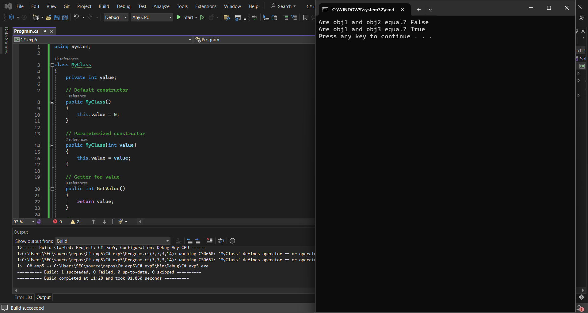

# 19AI308-Object-Oriented-Programming-using-CSharp--Ex5-Operator-Overloading

# AIM:
To write a C# program to pass values through constructors(default and parameterized) and also overload equal operators by checking whether objects 
are equal using operator overloading. 

# ALGORITHM:
### Step 1:
Initialize a default and a parameterized constructor.

### Step 2:
Overload using equalto symbols.

### Step 3:
Write the code to implement main function.

### Step 4:
Create objects obj1,obj2 and obj3.

### Step 5:
Check the equality.

# PROGRAM:
```
DEVELOPED BY : JAYABHARATHI S
REGISTER NO : 212222100013
```
```c#
using System;

class MyClass
{
    private int value;

    // Default constructor
    public MyClass()
    {
        this.value = 0;
    }

    // Parameterized constructor
    public MyClass(int value)
    {
        this.value = value;
    }

    // Getter for value
    public int GetValue()
    {
        return value;
    }

    // Overloading equality operator
    public static bool operator ==(MyClass obj1, MyClass obj2)
    {

        // Check if either of the objects is null
        if (obj1 is null || obj2 is null)
            return false;

        // Compare the values of the objects
        return obj1.value == obj2.value;
    }

    // Overloading inequality operator
    public static bool operator !=(MyClass obj1, MyClass obj2)
    {
        return !(obj1 == obj2);
    }
}

class Program
{
    static void Main(string[] args)
    {
        MyClass obj1 = new MyClass(10);
        MyClass obj2 = new MyClass(); // Using default constructor
        MyClass obj3 = new MyClass(10);

        // Check equality
        Console.WriteLine("Are obj1 and obj2 equal? " + (obj1 == obj2));
        Console.WriteLine("Are obj1 and obj3 equal? " + (obj1 == obj3));
    }
}
```
# OUTPUT:


# RESULT:
Thus,the program to illustrate operating overloading is successfully implemented.
